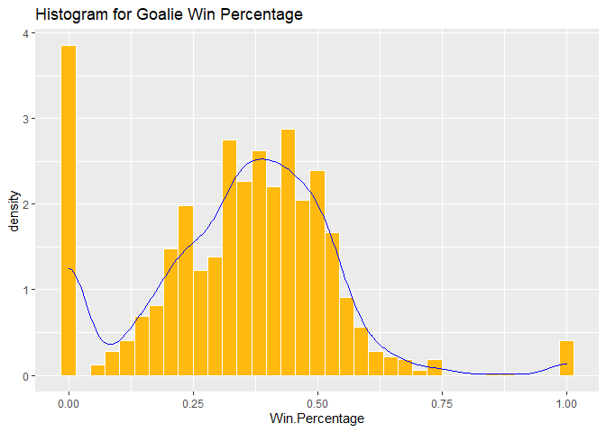
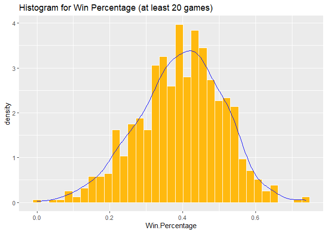
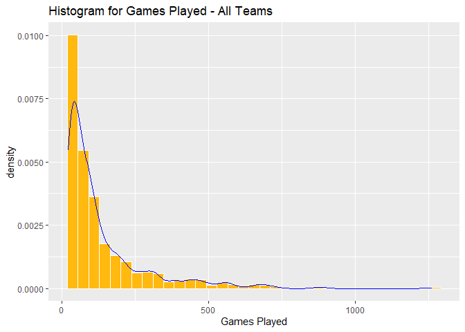
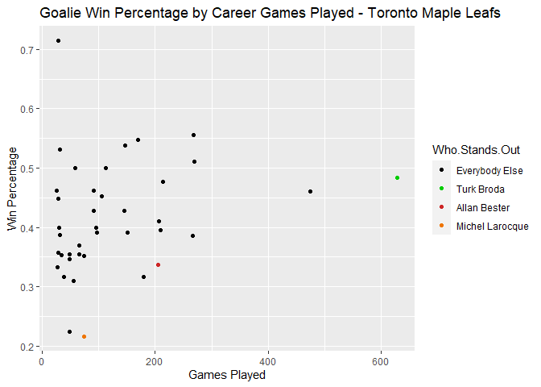
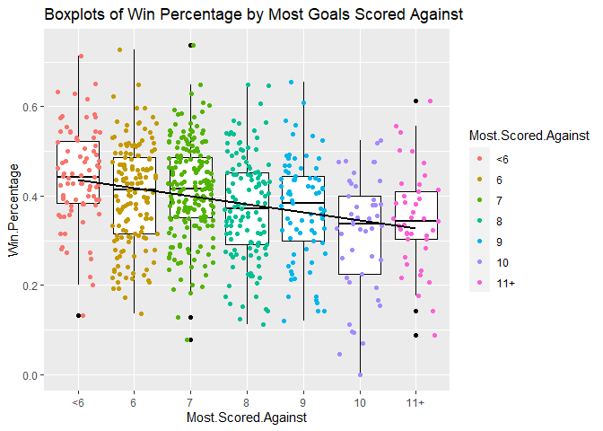
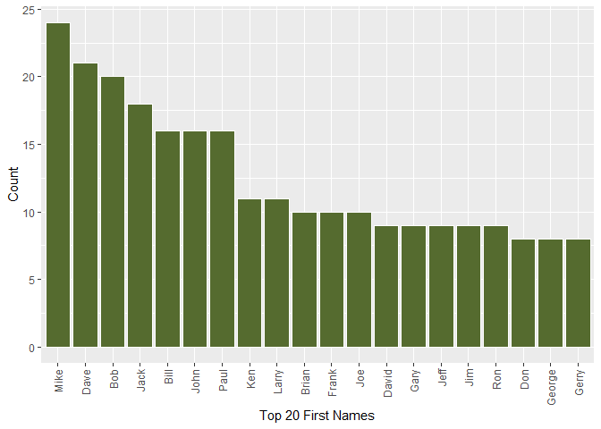
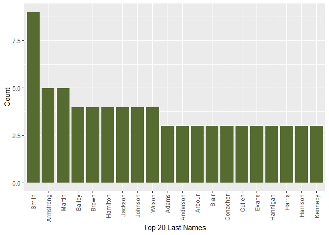
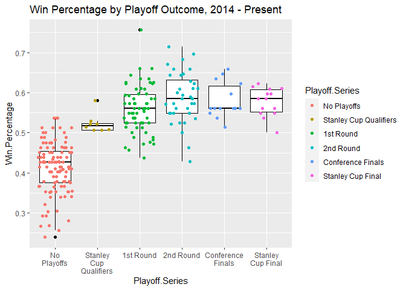

NHL Hockey: ST 558 Project 1
================
Peter Lung
6/12/2021

-   [Required Libraries](#required-libraries)
-   [Functions for pulling data](#functions-for-pulling-data)
-   [NHL Tables](#nhl-tables)
    -   [Franchises](#franchises)
    -   [Team Totals](#team-totals)
-   [NHL Data Analysis](#nhl-data-analysis)
    -   [Goalie Records](#goalie-records)
        -   [Histograms](#histograms)
        -   [Scatterplot](#scatterplot)
        -   [Most Goals Scored Against a Goalie in a Single
            Game](#most-goals-scored-against-a-goalie-in-a-single-game)
    -   [Player Names](#player-names)
-   [Bonus: Team Reg. Season Win % by Playoff
    Outcome](#bonus-team-reg-season-win--by-playoff-outcome)

# Required Libraries

``` r
library(httr)
library(stringr)
library(jsonlite)
library(ggplot2)
library(rmarkdown)
library(DT)
library(kableExtra)
library(dplyr)
```

    ## 
    ## Attaching package: 'dplyr'

    ## The following object is masked from 'package:kableExtra':
    ## 
    ##     group_rows

    ## The following objects are masked from 'package:stats':
    ## 
    ##     filter, lag

    ## The following objects are masked from 'package:base':
    ## 
    ##     intersect, setdiff, setequal, union

# Functions for pulling data

The hockey data I will be going over is accessible via the following
logic which returns the table of interest, subsetted by the team of
interest (if there is one). There are six records tables to choose from
as well as one stats table to choose from for pulling the data. +
Franchise table: Contains general information on each historical NHL
franchise + Team totals table: Contains some basic win/loss information
for each franchise + Season records + Goalie records + Skater records +
Recent team IDs

We’ll start with the preliminaries: establishing a base url and a
mapping for teams to team IDs.

``` r
#base url
base_url <- "https://records.nhl.com/site/api"

# Mapping team IDs to team names
Teams <- c("Montréal Canadiens", "Montreal Wanderers", "St. Louis Eagles", "Hamilton Tigers", "Toronto Maple Leafs", "Boston Bruins", "Montreal Maroons", "Brooklyn Americans", "Philadelphia Quakers", "New York Rangers", "Chicago Blackhawks", "Detroit Red Wings", "Cleveland Barons", "Los Angeles Kings", "Dallas Stars", "Philadelphia Flyers", "Pittsburgh Penguins", "St. Louis Blues", "Buffalo Sabres", "Vancouver Canucks", "Calgary Flames", "New York Islanders", "New Jersey Devils", "Washington Capitals", "Edmonton Oilers", "Carolina Hurricanes ", "Colorado Avalanche", "Arizona Coyotes", "San Jose Sharks", "Ottawa Senators ", "Tampa Bay Lightning", "Anaheim Ducks", "Florida Panthers", "Nashville Predators", "Winnipeg Jets", "Columbus Blue Jackets", "Minnesota Wild", "Vegas Golden Knights")
ID <- (1:38)
TeamMap <- data.frame(Teams, ID)
```

Next, we’ll start by creating the functions. The first one returns a
table that displays a number of facts about each team from history.

``` r
#franchise function
franchise <- function() {
  url <- paste0(base_url, "/franchise")
  get <- GET(url)
  txt <- content(get, "text", encoding = "UTF-8")
  json <- fromJSON(txt, flatten = TRUE)
  franch <- as.data.frame(json)
  return(franch)
}
```

The next function displayes win and loss data for each franchise over
its history.

``` r
#team totals function
team_tot <- function() {
  url <- paste0(base_url, "/franchise-team-totals")
  get <- GET(url)
  txt <- content(get, "text", encoding = "UTF-8")
  json <- fromJSON(txt, flatten = TRUE)
  team_tot <- as.data.frame(json)
  return(team_tot)
}
```

Next, the functions that return tables by team. The first one is the
season records table.

``` r
#season records function
season_rec <- function(team = "", team_id) {
  if (team == "all") {
    for (i in 1:38) {
      url <- paste0(base_url, "/franchise-season-records?cayenneExp=franchiseId==",toString(i))
      get <- GET(url)
      txt <- content(get, "text", encoding = "UTF-8")
      json <- fromJSON(txt, flatten = TRUE)
      if (i == 1) {SeasonPull <- as.data.frame(json)} else {SeasonPull <- rbind(SeasonPull, ... = as.data.frame(json))}}}
  else if (team == "") {
    url <- paste0(base_url, "/franchise-season-records?cayenneExp=franchiseId=",toString(team_id))
    get <- GET(url)
    txt <- content(get, "text", encoding = "UTF-8")
    json <- fromJSON(txt, flatten = TRUE)
    SeasonPull <- as.data.frame(json)}
  else {
    TeamName <- TeamMap %>% filter(Teams == team)
    j <- TeamName[1,2]
    url <- paste0(base_url, "/franchise-season-records?cayenneExp=franchiseId=",toString(j))
    get <- GET(url)
    txt <- content(get, "text", encoding = "UTF-8")
    json <- fromJSON(txt, flatten = TRUE)
    SeasonPull <- as.data.frame(json)}
  return(SeasonPull)
}
```

The goalie and skater data return the list of players for each team
(goalies in the first table, skaters in the second) and career records
for each player.

``` r
#goalie records totals function
goalie <- function(team = "", team_id) {
  if (team == "all") {
    for (i in 1:38) {
      url <- paste0(base_url, "/franchise-goalie-records?cayenneExp=franchiseId=",toString(i))
      get <- GET(url)
      txt <- content(get, "text", encoding = "UTF-8")
      json <- fromJSON(txt, flatten = TRUE)
      if (i == 1) {GoaliePull <- as.data.frame(json)} else {GoaliePull <- rbind(GoaliePull, ... = as.data.frame(json))}}}
  else if (team == "") {
    url <- paste0(base_url, "/franchise-goalie-records?cayenneExp=franchiseId=",toString(team_id))
    get <- GET(url)
    txt <- content(get, "text", encoding = "UTF-8")
    json <- fromJSON(txt, flatten = TRUE)
    GoaliePull <- as.data.frame(json)}
  else {
    TeamName <- TeamMap %>% filter(Teams == team)
    j <- TeamName[1,2]
    url <- paste0(base_url, "/franchise-goalie-records?cayenneExp=franchiseId=",toString(j))
    get <- GET(url)
    txt <- content(get, "text", encoding = "UTF-8")
    json <- fromJSON(txt, flatten = TRUE)
    GoaliePull <- as.data.frame(json)}
  return(GoaliePull)
}

#skater records totals function
skater <- function(team = "", team_id) {
  if (team == "all") {
    for (i in 1:38) {
      url <- paste0(base_url, "/franchise-skater-records?cayenneExp=franchiseId=",toString(i))
      get <- GET(url)
      txt <- content(get, "text", encoding = "UTF-8")
      json <- fromJSON(txt, flatten = TRUE)
      if (i == 1) {SkaterPull <- as.data.frame(json)} else {SkaterPull <- rbind(SkaterPull, ... = as.data.frame(json))}}}
  else if (team == "") {
    url <- paste0(base_url, "/franchise-skater-records?cayenneExp=franchiseId=",toString(team_id))
    get <- GET(url)
    txt <- content(get, "text", encoding = "UTF-8")
    json <- fromJSON(txt, flatten = TRUE)
    SkaterPull <- as.data.frame(json)}
  else {
    TeamName <- TeamMap %>% filter(Teams == team)
    j <- TeamName[1,2]
    url <- paste0(base_url, "/franchise-skater-records?cayenneExp=franchiseId=",toString(j))
    get <- GET(url)
    txt <- content(get, "text", encoding = "UTF-8")
    json <- fromJSON(txt, flatten = TRUE)
    SkaterPull <- as.data.frame(json)}
  return(SkaterPull)
}
```

Finally, the last table returns retired numbers and some other
team-specific data.

``` r
#Recent data pull function
recent <- function(team = "", team_id) {
  if (team == "all") {
    for (i in 1:38) {
      url <- paste0(base_url, "/franchise-detail?cayenneExp=mostRecentTeamId=",toString(i))
      get <- GET(url)
      txt <- content(get, "text", encoding = "UTF-8")
      json <- fromJSON(txt, flatten = TRUE)
      if (i == 1) {RecentPull <- as.data.frame(json)} else {RecentPull <- rbind(RecentPull, ... = as.data.frame(json))}}}
  else if (team == "") {
    url <- paste0(base_url, "/franchise-detail?cayenneExp=mostRecentTeamId=",toString(team_id))
    get <- GET(url)
    txt <- content(get, "text", encoding = "UTF-8")
    json <- fromJSON(txt, flatten = TRUE)
    RecentPull <- as.data.frame(json)}
  else {
    TeamName <- TeamMap %>% filter(Teams == team)
    j <- TeamName[1,2]
    url <- paste0(base_url, "/franchise-detail?cayenneExp=mostRecentTeamId=",toString(j))
    get <- GET(url)
    txt <- content(get, "text", encoding = "UTF-8")
    json <- fromJSON(txt, flatten = TRUE)
    RecentPull <- as.data.frame(json)}
  return(RecentPull)
}
```

This function returns a table from the stats API.

``` r
#Stats API data pull function 

# Mapping team IDs to team names (team IDs are different in the Stats API)
TeamsS <- c("Devils", "Islanders", "Rangers", "Flyers", "Penguins", "Bruins", "Sabres", "Canadiens", "Senators", "Maple Leafs", "Hurricanes", "Panthers", "Lightning", "Capitals", "Blackhawks", "Red Wings", "Predators", "Blues", "Flames", "Avalanche", "Oilers", "Canucks", "Ducks", "Stars", "Kings", "Sharks ", "Blue Jackets", "Wild", "Jets", "Coyotes ", "Golden Knights", "Kraken")
ID_S <- c((1:10), (12:26), (28:30), (52:55))
StatsMap <- data.frame(Teams, ID)

statsapi <- function(team = "", team_id) {
  if (team == "all") {
    for (i in ID_S) {
      url <- paste0("https://statsapi.web.nhl.com/api/v1/teams/",toString(i),"?expand=team.stats")
      get <- GET(url)
      txt <- content(get, "text", encoding = "UTF-8")
      json <- fromJSON(txt, flatten = TRUE)
      if (i == 1) {StatsPull <- as.data.frame(json)} else {StatsPull <- rbind(StatsPull, ... = as.data.frame(json))}}}
  else if (team == "") {
    url <- paste0("https://statsapi.web.nhl.com/api/v1/teams/",toString(team_id),"?expand=team.stats")
    get <- GET(url)
    txt <- content(get, "text", encoding = "UTF-8")
    json <- fromJSON(txt, flatten = TRUE)
    StatsPull <- as.data.frame(json)}
  else {
    TeamName <- StatsMap %>% filter(TeamsS == team)
    j <- TeamName[1,2]
    url <- paste0(base_url, "https://statsapi.web.nhl.com/api/v1/teams/",toString(j),"?expand=team.stats")
    get <- GET(url)
    txt <- content(get, "text", encoding = "UTF-8")
    json <- fromJSON(txt, flatten = TRUE)
    StatsPull <- as.data.frame(json)}
  return(StatsPull)
}
```

The above functions return the individual table of interest, but the
following wrapper function will be the only function needed to pull any
table from above. Example syntax is shown in the latter sections. You
will need to specify a table of interest as well as either a team or
team\_id value if the table contains team-specific data.

``` r
nhl <- function(table,...) {
  if (table == "franchise") {df <- franchise()}
  else if (table == "team_tot") {df <- team_tot()}
  else if (table == "season_rec") {df <- season_rec(...)}
  else if (table == "goalie") {df <- goalie(...)}
  else if (table == "skater") {df <- skater(...)}
  else if (table == "recent") {df <- recent(...)}
  else if (table == "statsapi") {df <- statsapi(...)}
  else {df <- NULL}
  return(df)
}
```

# NHL Tables

Let’s take a look at how the nhl() function works for the first two
datasets. We will create html tables to view this data.

## Franchises

``` r
#Pulling and formatting the franchise data

franch <- nhl("franchise")
franch <- franch %>% select(data.fullName, data.firstSeasonId, data.lastSeasonId, data.teamAbbrev, data.teamCommonName, data.teamPlaceName) %>% rename("Team" = "data.fullName", "First Season" = "data.firstSeasonId", "Last Season" = "data.lastSeasonId", "Abbrev" = "data.teamAbbrev", "Common Name" = "data.teamCommonName", "City" = "data.teamPlaceName")

datatable(franch, extensions = c('FixedColumns',"FixedHeader"), options = list(scrollX = FALSE, paging=TRUE, fixedHeader=TRUE))
```

    ## PhantomJS not found. You can install it with webshot::install_phantomjs(). If it is installed, please make sure the phantomjs executable can be found via the PATH variable.

<div id="htmlwidget-8a38b5cead96d308f54f" style="width:100%;height:auto;" class="datatables html-widget"></div>
<script type="application/json" data-for="htmlwidget-8a38b5cead96d308f54f">{"x":{"filter":"none","extensions":["FixedColumns","FixedHeader"],"data":[["1","2","3","4","5","6","7","8","9","10","11","12","13","14","15","16","17","18","19","20","21","22","23","24","25","26","27","28","29","30","31","32","33","34","35","36","37","38","39"],["Montréal Canadiens","Montreal Wanderers","St. Louis Eagles","Hamilton Tigers","Toronto Maple Leafs","Boston Bruins","Montreal Maroons","Brooklyn Americans","Philadelphia Quakers","New York Rangers","Chicago Blackhawks","Detroit Red Wings","Cleveland Barons","Los Angeles Kings","Dallas Stars","Philadelphia Flyers","Pittsburgh Penguins","St. Louis Blues","Buffalo Sabres","Vancouver Canucks","Calgary Flames","New York Islanders","New Jersey Devils","Washington Capitals","Edmonton Oilers","Carolina Hurricanes","Colorado Avalanche","Arizona Coyotes","San Jose Sharks","Ottawa Senators","Tampa Bay Lightning","Anaheim Ducks","Florida Panthers","Nashville Predators","Winnipeg Jets","Columbus Blue Jackets","Minnesota Wild","Vegas Golden Knights","Seattle Kraken"],[19171918,19171918,19171918,19191920,19171918,19241925,19241925,19251926,19251926,19261927,19261927,19261927,19671968,19671968,19671968,19671968,19671968,19671968,19701971,19701971,19721973,19721973,19741975,19741975,19791980,19791980,19791980,19791980,19911992,19921993,19921993,19931994,19931994,19981999,19992000,20002001,20002001,20172018,20212022],[null,19171918,19341935,19241925,null,null,19371938,19411942,19301931,null,null,null,19771978,null,null,null,null,null,null,null,null,null,null,null,null,null,null,null,null,null,null,null,null,null,null,null,null,null,null],["MTL","MWN","SLE","HAM","TOR","BOS","MMR","BRK","QUA","NYR","CHI","DET","CLE","LAK","DAL","PHI","PIT","STL","BUF","VAN","CGY","NYI","NJD","WSH","EDM","CAR","COL","ARI","SJS","OTT","TBL","ANA","FLA","NSH","WPG","CBJ","MIN","VGK","SEA"],["Canadiens","Wanderers","Eagles","Tigers","Maple Leafs","Bruins","Maroons","Americans","Quakers","Rangers","Blackhawks","Red Wings","Barons","Kings","Stars","Flyers","Penguins","Blues","Sabres","Canucks","Flames","Islanders","Devils","Capitals","Oilers","Hurricanes","Avalanche","Coyotes","Sharks","Senators","Lightning","Ducks","Panthers","Predators","Jets","Blue Jackets","Wild","Golden Knights","Kraken"],["Montréal","Montreal","St. Louis","Hamilton","Toronto","Boston","Montreal","Brooklyn","Philadelphia","New York","Chicago","Detroit","Cleveland","Los Angeles","Dallas","Philadelphia","Pittsburgh","St. Louis","Buffalo","Vancouver","Calgary","New York","New Jersey","Washington","Edmonton","Carolina","Colorado","Arizona","San Jose","Ottawa","Tampa Bay","Anaheim","Florida","Nashville","Winnipeg","Columbus","Minnesota","Vegas","Seattle"]],"container":"<table class=\"display\">\n  <thead>\n    <tr>\n      <th> <\/th>\n      <th>Team<\/th>\n      <th>First Season<\/th>\n      <th>Last Season<\/th>\n      <th>Abbrev<\/th>\n      <th>Common Name<\/th>\n      <th>City<\/th>\n    <\/tr>\n  <\/thead>\n<\/table>","options":{"scrollX":false,"paging":true,"fixedHeader":true,"columnDefs":[{"className":"dt-right","targets":[2,3]},{"orderable":false,"targets":0}],"order":[],"autoWidth":false,"orderClasses":false}},"evals":[],"jsHooks":[]}</script>

## Team Totals

``` r
#Pulling and formatting the Team Totals data

TeamTotals <- nhl("team_tot")
TeamTotals <- TeamTotals %>% filter(data.gameTypeId == '2') %>% select(data.teamName, data.firstSeasonId, data.gamesPlayed, data.goalsFor, data.goalsAgainst, data.homeWins, data.homeLosses, data.homeTies, data.roadWins, data.roadLosses, data.roadTies) %>% rename("Team" = "data.teamName", "First Season" = "data.firstSeasonId", "Games" = "data.gamesPlayed", "Goals Scored" = "data.goalsFor", "Goals Scored Against" = "data.goalsAgainst", "Home Wins" = "data.homeWins", "Home Losses" = "data.homeLosses", "Home Ties" = "data.homeTies", "Road Wins" = "data.roadWins", "Road Losses" = "data.roadLosses", "Road Ties" = "data.roadTies")

datatable(TeamTotals, extensions = c('FixedColumns',"FixedHeader"), options = list(scrollX = FALSE, paging=TRUE, fixedHeader=TRUE))
```

<div id="htmlwidget-ed52cfc231b940d24fea" style="width:100%;height:auto;" class="datatables html-widget"></div>
<script type="application/json" data-for="htmlwidget-ed52cfc231b940d24fea">{"x":{"filter":"none","extensions":["FixedColumns","FixedHeader"],"data":[["1","2","3","4","5","6","7","8","9","10","11","12","13","14","15","16","17","18","19","20","21","22","23","24","25","26","27","28","29","30","31","32","33","34","35","36","37","38","39","40","41","42","43","44","45","46","47","48","49","50","51","52","53","54","55","56","57"],["New Jersey Devils","New York Islanders","New York Rangers","Philadelphia Flyers","Pittsburgh Penguins","Boston Bruins","Buffalo Sabres","Montréal Canadiens","Ottawa Senators","Toronto Maple Leafs","Atlanta Thrashers","Carolina Hurricanes","Florida Panthers","Tampa Bay Lightning","Washington Capitals","Chicago Blackhawks","Detroit Red Wings","Nashville Predators","St. Louis Blues","Calgary Flames","Colorado Avalanche","Edmonton Oilers","Vancouver Canucks","Anaheim Ducks","Dallas Stars","Los Angeles Kings","Phoenix Coyotes","San Jose Sharks","Columbus Blue Jackets","Minnesota Wild","Minnesota North Stars","Quebec Nordiques","Winnipeg Jets (1979)","Hartford Whalers","Colorado Rockies","Ottawa Senators (1917)","Hamilton Tigers","Pittsburgh Pirates","Philadelphia Quakers","Detroit Cougars","Montreal Wanderers","Quebec Bulldogs","Montreal Maroons","New York Americans","St. Louis Eagles","Oakland Seals","Atlanta Flames","Kansas City Scouts","Cleveland Barons","Detroit Falcons","Brooklyn Americans","Winnipeg Jets","Arizona Coyotes","Vegas Golden Knights","California Golden Seals","Toronto Arenas","Toronto St. Patricks"],[19821983,19721973,19261927,19671968,19671968,19241925,19701971,19171918,19921993,19271928,19992000,19971998,19931994,19921993,19741975,19261927,19321933,19981999,19671968,19801981,19951996,19791980,19701971,19931994,19931994,19671968,19961997,19911992,20002001,20002001,19671968,19791980,19791980,19791980,19761977,19171918,19201921,19251926,19301931,19261927,19171918,19191920,19241925,19251926,19341935,19671968,19721973,19741975,19761977,19301931,19411942,20112012,20142015,20172018,19701971,19171918,19191920],[2993,3788,6560,4171,4171,6626,3945,6787,2195,6516,902,1812,2109,2194,3633,6560,6293,1731,4173,3154,1978,3235,3945,2111,2109,4172,1360,2274,1568,1567,2062,1256,1338,1420,480,542,126,212,44,176,6,24,622,736,48,226,636,160,160,92,48,749,536,291,472,40,230],[8792,12045,20041,13690,13874,21112,12471,21791,6250,19980,2465,4914,5665,6216,11516,19537,19550,4730,12827,10257,5857,10776,12138,5693,6022,13053,3632,6490,4092,4166,6690,4625,4762,4704,1426,1458,414,376,76,353,17,91,1474,1510,86,541,2057,374,470,197,133,2209,1345,939,1285,173,724],[8902,11907,20020,12255,14049,19137,11966,18260,6580,19953,3014,5140,6122,6646,11553,19687,18881,4708,12688,9821,5458,10633,12999,5838,5609,13761,3824,6618,4612,4135,7373,4883,5347,5345,1957,1333,475,519,184,380,37,177,1405,2007,144,713,2013,679,617,213,175,2151,1619,793,1867,201,768],[790,963,1614,1216,1138,1885,1053,2038,533,1702,183,453,485,559,959,1655,1741,477,1122,863,543,830,943,557,594,1027,340,589,390,429,477,300,307,318,78,160,33,41,3,35,1,4,156,147,7,44,161,20,28,25,10,207,116,96,84,15,73],[525,678,1143,584,683,960,639,881,413,1082,204,323,390,414,620,1128,940,282,674,508,327,587,736,359,314,776,249,407,300,243,391,245,274,297,115,81,30,55,17,42,2,8,107,154,14,46,104,44,34,10,12,136,120,38,100,5,37],[96,170,448,193,205,376,197,381,60,388,26,52,65,56,153,410,368,34,218,135,55,125,210,58,65,211,43,58,18,28,163,83,88,95,47,30,0,10,2,11,0,0,48,67,3,23,53,16,18,11,2,null,null,null,52,0,5],[604,725,1269,863,765,1356,752,1435,438,1171,159,374,404,426,741,1157,1150,375,807,634,464,639,706,433,490,727,275,481,288,330,281,197,199,216,35,98,14,26,1,29,0,0,115,92,4,22,107,7,19,9,6,175,98,77,32,3,36],[686,909,1573,868,1051,1443,925,1421,527,1614,233,402,480,533,847,1633,1506,374,971,728,401,750,1010,475,424,1053,297,513,398,356,579,354,386,412,166,140,48,67,19,45,3,12,153,219,17,72,156,66,53,31,17,156,142,56,183,17,74],[123,177,360,264,178,415,212,456,55,385,19,34,77,56,150,404,405,26,214,136,46,137,181,49,60,213,51,63,15,27,171,77,84,82,39,33,1,13,2,14,0,0,43,57,3,19,55,7,8,6,1,null,null,null,21,0,5]],"container":"<table class=\"display\">\n  <thead>\n    <tr>\n      <th> <\/th>\n      <th>Team<\/th>\n      <th>First Season<\/th>\n      <th>Games<\/th>\n      <th>Goals Scored<\/th>\n      <th>Goals Scored Against<\/th>\n      <th>Home Wins<\/th>\n      <th>Home Losses<\/th>\n      <th>Home Ties<\/th>\n      <th>Road Wins<\/th>\n      <th>Road Losses<\/th>\n      <th>Road Ties<\/th>\n    <\/tr>\n  <\/thead>\n<\/table>","options":{"scrollX":false,"paging":true,"fixedHeader":true,"columnDefs":[{"className":"dt-right","targets":[2,3,4,5,6,7,8,9,10,11]},{"orderable":false,"targets":0}],"order":[],"autoWidth":false,"orderClasses":false}},"evals":[],"jsHooks":[]}</script>

# NHL Data Analysis

## Goalie Records

Do teams keep under-performing goalies around for a long time? I was
curious to see win percentage by number of games played. Of course,
there could be a lot of things going on here, but I am interested in the
lower-right quadrant of the scatterplot of win percentage and games
played. Are there goalies who just have long losing careers? Maybe they
are good, but they are just stuck on losing teams all of the time? Maybe
they aren’t good, and they contribute to losing records, but teams keep
them around?

### Histograms

Before we jump into the analysis, let’s do some data investigation. We
will start with histograms of the variables we are interested in. The
following is a histogram with all teams included:

``` r
#Pulling Goalie data and creating a histogram
GoalieRecords <- nhl("goalie", team = "all") %>% mutate(Win.Percentage = data.wins / data.gamesPlayed)

g1 <- ggplot(GoalieRecords, aes(x = Win.Percentage, , y = ..density..))
g1 + geom_histogram(color = "white", fill = "darkgoldenrod1", bins = 35) + geom_density(color = "blue") + labs(title = "Histogram for Goalie Win Percentage")
```

<!-- -->

There are several players with a win percentage of 0% and a few with
100%. This is because many of these players have only played in a few
games. I think it makes sense to filter out goalies who have played less
than 20 games so that we have appropriate sample sizes. Removing those
players and re-creating the histogram:

``` r
#Updating the data and reprinting the histogram

GoalieRecords <- filter(GoalieRecords, data.gamesPlayed >=20)

g2 <- ggplot(GoalieRecords, aes(x = Win.Percentage, , y = ..density..))
g2 + geom_histogram(color = "white", fill = "darkgoldenrod1", bins = 35) + geom_density(color = "blue") + labs(title = "Histogram for Win Percentage (at least 20 games)")
```

<!-- -->

So let’s see how that distribution compares to the Toronto Maple Leafs.

``` r
#Team-level histogram
tGoalieRecords <- nhl("goalie", team_id = team_id) %>% mutate(Win.Percentage = data.wins / data.gamesPlayed) %>% filter(data.gamesPlayed >=20)

t2 <- ggplot(tGoalieRecords, aes(x = Win.Percentage))
t2 + geom_histogram(color = "white", fill = "darkgoldenrod", bins = 35) + labs(title = paste0("Histogram for Win Percentage (at least 20 games) - ", team))
```

<!-- -->

Now that we have removed players with under 20 games, let’s look at a
histogram of games played.:

``` r
#Games Played Histogram

g3 <- ggplot(GoalieRecords, aes(x = data.gamesPlayed, , y = ..density..))
g3 + geom_histogram(color = "white", fill = "darkgoldenrod1", bins = 35) + geom_density(color = "blue") + labs(title = "Histogram for Games Played - All Teams") + xlab("Games Played")
```

<!-- -->

``` r
#Team - level games played

t3 <- ggplot(tGoalieRecords, aes(x = data.gamesPlayed))
t3 + geom_histogram(color = "white", fill = "darkgoldenrod", bins = 35) + labs(title = paste0("Histogram for Games Played - ", team)) + xlab("Games Played")
```

<!-- -->

### Scatterplot

I am interested in statistics around goalie career losses and lowest
winning percentages. Players can get stuck on losing teams even if they
are very good (just ask Mike Trout). I want to see who these goalies
might be in the NHL and just how badly their careers went.

We continue the analysis with a scatterplot of win percentage by games
played.

``` r
#Find out who had the most losses
MostLosses <- max(GoalieRecords$data.losses)
Loser <- filter(GoalieRecords, data.losses == MostLosses) %>% select(data.firstName, data.lastName, data.gamesPlayed)

#Lowest winning percentage in over 500 games
FrustratedPct <- min(filter(GoalieRecords, data.gamesPlayed > 500) %>% select(Win.Percentage))
Frustrated <- filter(GoalieRecords, data.gamesPlayed > 500) %>% filter(Win.Percentage == min(FrustratedPct))  %>% select(data.firstName, data.lastName, data.gamesPlayed)

# Lowest winning percentage in the sample set (get max games played if there's a tie)
LowestPct <- min(GoalieRecords$Win.Percentage)
Lowest <- filter(GoalieRecords, Win.Percentage == LowestPct)  %>% select(data.firstName, data.lastName, data.gamesPlayed) %>% filter(data.gamesPlayed == max(data.gamesPlayed))

GoalieRecords <- mutate(GoalieRecords, Who.Stands.Out = ifelse(Win.Percentage == LowestPct , paste0(data.firstName, " ", data.lastName), ifelse(Win.Percentage == FrustratedPct, paste0(data.firstName, " ", data.lastName), ifelse(data.losses == MostLosses, paste0(data.firstName, " ", data.lastName), "Everybody Else"))))


g4 <- ggplot(GoalieRecords, aes(x = data.gamesPlayed, y = Win.Percentage, color = Who.Stands.Out))
g4 + geom_point() + labs(title = "Goalie Win Percentage by Career Games Played - All Teams") + xlab("Games Played") + ylab("Win Percentage") + scale_color_manual(values=c("grey60", "green3", "firebrick3", "darkorange2"))
```

<!-- -->

``` r
#Print notable goalie names based on data input
BiggestLoser <- paste0("The goalie with the most losses is ", Loser[1,1]," " , Loser[1,2], " with ", toString(MostLosses), ".")

MostFrustrated <- paste0("The goalie with the lowest win percentage (over 500 games) is ", Frustrated[1,1]," ", Frustrated[1,2], " at ", toString(round(100 * FrustratedPct, 1)),"% in ", toString(Frustrated[1,3]), " games.")

LowestRate <- paste0("The goalie with the lowest win percentage in the whole sample is ", Lowest[1,1]," ", Lowest[1,2], " at ", toString(round(LowestPct, 1)), "% in ", toString(Lowest[1,3]), " games.")
```

Win percentage is defined as win (not ties) divided by total games.
Total games include ties.

Well, it looks like if you are really a loser, they don’t keep you in
the goal for *that* many games. Three players stand out to me from the
graph:

The goalie with the most losses is Martin Brodeur with 394.

The goalie with the lowest win percentage (over 500 games) is Gump
Worsley at 35.1% in 581 games.

The goalie with the lowest win percentage in the whole sample is Michel
Belhumeur at 0% in 42 games.

Total losses are probably more related to longevity than an extended
poor performance. Having a zero or near-zero win percentage in 40+ games
seems to be quite an anomaly. Even highly likely events can have a
non-zero probability of occurring.

Compare with the scatterplot for the Toronto Maple Leafs.

``` r
#Find out who had the most losses
tMostLosses <- max(tGoalieRecords$data.losses)
tLoser <- filter(tGoalieRecords, data.losses == tMostLosses) %>% select(data.firstName, data.lastName, data.gamesPlayed)  %>% filter(data.gamesPlayed == max(data.gamesPlayed))

#Lowest winning percentage in over 500 games
tFrustratedPct <- min(filter(tGoalieRecords, data.gamesPlayed > 200) %>% select(Win.Percentage))
tFrustrated <- filter(tGoalieRecords, data.gamesPlayed > 200) %>% filter(Win.Percentage == min(tFrustratedPct))  %>% select(data.firstName, data.lastName, data.gamesPlayed)  %>% filter(data.gamesPlayed == max(data.gamesPlayed))

# Lowest winning percentage in the sample set (get max games played if there's a tie)
tLowestPct <- min(tGoalieRecords$Win.Percentage)
tLowest <- filter(tGoalieRecords, Win.Percentage == tLowestPct)  %>% select(data.firstName, data.lastName, data.gamesPlayed) %>% filter(data.gamesPlayed == max(data.gamesPlayed))

tGoalieRecords <- mutate(tGoalieRecords, Who.Stands.Out = ifelse(Win.Percentage == tLowestPct , paste0(data.firstName, " ", data.lastName), ifelse(Win.Percentage == tFrustratedPct, paste0(data.firstName, " ", data.lastName), ifelse(data.losses == tMostLosses, paste0(data.firstName, " ", data.lastName), "Everybody Else"))))
tGoalieRecords$Who.Stands.Out <- factor(tGoalieRecords$Who.Stands.Out, levels = c("Everybody Else", paste0(tLoser[1,1]," " , tLoser[1,2]), paste0(tFrustrated[1,1]," ", tFrustrated[1,2]), paste0(tLowest[1,1]," ", tLowest[1,2])))


t4 <- ggplot(tGoalieRecords, aes(x = data.gamesPlayed, y = Win.Percentage, color = Who.Stands.Out))
t4 + geom_point() + labs(title = paste0("Goalie Win Percentage by Career Games Played - ", team)) + xlab("Games Played") + ylab("Win Percentage") + scale_color_manual(values=c("black", "green3", "firebrick3", "darkorange2"))
```

<!-- -->

``` r
#print notable goalie names based on team input
tBiggestLoser <- paste0("The goalie with the most losses for ", team, " is ", tLoser[1,1]," " , tLoser[1,2], " with ", toString(tMostLosses), ".")

tMostFrustrated <- paste0("The goalie with the lowest win percentage for the ", team, " (over 200 games) is ", tFrustrated[1,1]," ", tFrustrated[1,2], " at ", toString(round(100 * tFrustratedPct, 1)),"% in ", toString(tFrustrated[1,3]), " games.")

tLowestRate <- paste0("The goalie with the lowest win percentage for the ", team, " in the whole sample is ", tLowest[1,1]," ", tLowest[1,2], " at ", toString(round(100 * tLowestPct, 1)), "% in ", toString(tLowest[1,3]), " games.")
```

Since some teams don’t have goalies with 500+ games, the parameter is
changed to 200 games.

The goalie with the most losses for Toronto Maple Leafs is Turk Broda
with 222.

The goalie with the lowest win percentage for the Toronto Maple Leafs
(over 200 games) is Allan Bester at 33.7% in 205 games.

The goalie with the lowest win percentage for the Toronto Maple Leafs in
the whole sample is Michel Larocque at 21.6% in 74 games.

### Most Goals Scored Against a Goalie in a Single Game

The data has an interesting statistic that might be worth looking at:
most goals scored on a goalie in a single game. It would be unfair to
judge a player’s career by their worst game, but in the name of data
analysis, let’s see if there are any relationships there.

Keeping with the 20 game minimum, we’ll start with a histogram:

``` r
#Most goals histogram
g5 <- ggplot(GoalieRecords, aes(x = data.mostGoalsAgainstOneGame, , y = ..density..))
g5 + geom_histogram(color = "white", fill = "darkgoldenrod1", bins = 35) + labs(title = "Histogram for Single Game Goals Scored Against - All Teams") + xlab("Most Goals Scored Against in a Single Game")
```

<!-- -->

It seems that there are very few where the number of goals is over 11 or
under 5, so let’s create a set of categorical variables that denote most
goals scored against with categories “&lt;=5”, “6”, “7”,…,“10”, “11+”.

``` r
#Modify data to make categories
ScoredAgainst <- mutate(GoalieRecords, Most.Scored.Against = recode(data.mostGoalsAgainstOneGame,
                                                                    "1" = "<6",
                                                                    "2" = "<6",
                                                                    "3" = "<6",
                                                                    "4" = "<6",
                                                                    "5" = "<6",
                                                                    "6" = "6",
                                                                    "7" = "7",
                                                                    "8" = "8",
                                                                    "9" = "9",
                                                                    "10" = "10",
                                                                    .default = "11+"))

ScoredAgainst$Most.Scored.Against <- factor(ScoredAgainst$Most.Scored.Against, levels = c("<6", "6", "7", "8", "9", "10", "11+"))

df0 <- filter(ScoredAgainst, Most.Scored.Against == "<6")
Defense <- as.data.frame(t(round(summary(df0$Win.Percentage),3))) %>% rename(Stat = Var2) %>% select(Stat, Freq)  %>% rename("<6" = "Freq")
df1 <- filter(ScoredAgainst, Most.Scored.Against == "6")
A <- as.data.frame(t(round(summary(df1$Win.Percentage),3) )) %>% rename(Stat = Var2) %>% select(Stat, Freq) %>% rename("6" = "Freq")
df2 <- filter(ScoredAgainst, Most.Scored.Against == "7")
B <- as.data.frame(t(round(summary(df2$Win.Percentage),3))) %>% rename(Stat = Var2) %>% select(Stat, Freq) %>% rename("7" = "Freq")
df3 <- filter(ScoredAgainst, Most.Scored.Against == "8")
C <- as.data.frame(t(round(summary(df3$Win.Percentage),3))) %>% rename(Stat = Var2) %>% select(Stat, Freq) %>% rename("8" = "Freq")
df4 <- filter(ScoredAgainst, Most.Scored.Against == "9")
D <- as.data.frame(t(round(summary(df4$Win.Percentage),3))) %>% rename(Stat = Var2) %>% select(Stat, Freq) %>% rename("9" = "Freq")
df5 <- filter(ScoredAgainst, Most.Scored.Against == "10")
E <- as.data.frame(t(round(summary(df5$Win.Percentage),3))) %>% rename(Stat = Var2) %>% select(Stat, Freq) %>% rename("10" = "Freq")
df6 <- filter(ScoredAgainst, Most.Scored.Against == "11+")
F <- as.data.frame(t(round(summary(df6$Win.Percentage),3))) %>% rename(Stat = Var2) %>% select(Stat, Freq) %>% rename("11+" = "Freq")

tScoredAgainst <- filter(ScoredAgainst, , data.franchiseName == team)

#Format data for input into table

tdf0 <- filter(tScoredAgainst, Most.Scored.Against == "<6")
tDefense <- as.data.frame(t(round(summary(tdf0$Win.Percentage),3))) %>% rename(Stat = Var2) %>% select(Stat, Freq)  %>% rename("<6" = "Freq")
tdf1 <- filter(tScoredAgainst, Most.Scored.Against == "6")
tA <- as.data.frame(t(round(summary(tdf1$Win.Percentage),3) )) %>% rename(Stat = Var2) %>% select(Stat, Freq) %>% rename("6" = "Freq")
tdf2 <- filter(tScoredAgainst, Most.Scored.Against == "7")
tB <- as.data.frame(t(round(summary(tdf2$Win.Percentage),3))) %>% rename(Stat = Var2) %>% select(Stat, Freq) %>% rename("7" = "Freq")
tdf3 <- filter(tScoredAgainst, Most.Scored.Against == "8")
tC <- as.data.frame(t(round(summary(tdf3$Win.Percentage),3))) %>% rename(Stat = Var2) %>% select(Stat, Freq) %>% rename("8" = "Freq")
tdf4 <- filter(tScoredAgainst, Most.Scored.Against == "9")
tD <- as.data.frame(t(round(summary(tdf4$Win.Percentage),3))) %>% rename(Stat = Var2) %>% select(Stat, Freq) %>% rename("9" = "Freq")
tdf5 <- filter(tScoredAgainst, Most.Scored.Against == "10")
tE <- as.data.frame(t(round(summary(tdf5$Win.Percentage),3))) %>% rename(Stat = Var2) %>% select(Stat, Freq) %>% rename("10" = "Freq")
tdf6 <- filter(tScoredAgainst, Most.Scored.Against == "11+")
tF <- as.data.frame(t(round(summary(tdf6$Win.Percentage),3))) %>% rename(Stat = Var2) %>% select(Stat, Freq) %>% rename("11+" = "Freq")

#Combine data
Defense <- Defense %>% left_join(A, by = "Stat") %>% left_join(B, by = "Stat") %>% left_join(C, by = "Stat") %>% left_join(D, by = "Stat") %>% left_join(E, by = "Stat") %>% left_join(F, by = "Stat")

tDefense <- tDefense %>% left_join(tA, by = "Stat") %>% left_join(tB, by = "Stat") %>% left_join(tC, by = "Stat") %>% left_join(tD, by = "Stat") %>% left_join(tE, by = "Stat") %>% left_join(tF, by = "Stat")

Defense <- Defense %>% rename(" " = "Stat")
tDefense <- tDefense %>% rename(" " = "Stat")

sampsize <- as.data.frame(t(c("n", nrow(df0), nrow(df1), nrow(df2), nrow(df3), nrow(df4), nrow(df5), nrow(df6)))) %>% rename(" " = "V1", "<6" = "V2", "6" = "V3", "7" = "V4", "8" = "V5", "9" = "V6", "10" = "V7", "11+" = "V8")

tsampsize <- as.data.frame(t(c("n", nrow(tdf0), nrow(tdf1), nrow(tdf2), nrow(tdf3), nrow(tdf4), nrow(tdf5), nrow(tdf6)))) %>% rename(" " = "V1", "<6" = "V2", "6" = "V3", "7" = "V4", "8" = "V5", "9" = "V6", "10" = "V7", "11+" = "V8")

Defense <- rbind(Defense, sampsize)
tDefense <- rbind(tDefense, tsampsize)

#Print table

kable(Defense, caption = "Summaries Statistics for Win Percentage by Career 'Most Goals Scored Against' - All Teams", digits = 3) %>% kable_styling()
```

<table class="table" style="margin-left: auto; margin-right: auto;">
<caption>
Summaries Statistics for Win Percentage by Career ‘Most Goals Scored
Against’ - All Teams
</caption>
<thead>
<tr>
<th style="text-align:left;">
</th>
<th style="text-align:left;">
&lt;6
</th>
<th style="text-align:left;">
6
</th>
<th style="text-align:left;">
7
</th>
<th style="text-align:left;">
8
</th>
<th style="text-align:left;">
9
</th>
<th style="text-align:left;">
10
</th>
<th style="text-align:left;">
11+
</th>
</tr>
</thead>
<tbody>
<tr>
<td style="text-align:left;">
Min.
</td>
<td style="text-align:left;">
0.132
</td>
<td style="text-align:left;">
0.136
</td>
<td style="text-align:left;">
0.077
</td>
<td style="text-align:left;">
0.111
</td>
<td style="text-align:left;">
0.12
</td>
<td style="text-align:left;">
0
</td>
<td style="text-align:left;">
0.087
</td>
</tr>
<tr>
<td style="text-align:left;">
1st Qu.
</td>
<td style="text-align:left;">
0.383
</td>
<td style="text-align:left;">
0.314
</td>
<td style="text-align:left;">
0.351
</td>
<td style="text-align:left;">
0.29
</td>
<td style="text-align:left;">
0.3
</td>
<td style="text-align:left;">
0.225
</td>
<td style="text-align:left;">
0.303
</td>
</tr>
<tr>
<td style="text-align:left;">
Median
</td>
<td style="text-align:left;">
0.441
</td>
<td style="text-align:left;">
0.414
</td>
<td style="text-align:left;">
0.416
</td>
<td style="text-align:left;">
0.372
</td>
<td style="text-align:left;">
0.383
</td>
<td style="text-align:left;">
0.337
</td>
<td style="text-align:left;">
0.342
</td>
</tr>
<tr>
<td style="text-align:left;">
Mean
</td>
<td style="text-align:left;">
0.444
</td>
<td style="text-align:left;">
0.403
</td>
<td style="text-align:left;">
0.413
</td>
<td style="text-align:left;">
0.374
</td>
<td style="text-align:left;">
0.371
</td>
<td style="text-align:left;">
0.314
</td>
<td style="text-align:left;">
0.348
</td>
</tr>
<tr>
<td style="text-align:left;">
3rd Qu.
</td>
<td style="text-align:left;">
0.523
</td>
<td style="text-align:left;">
0.486
</td>
<td style="text-align:left;">
0.485
</td>
<td style="text-align:left;">
0.453
</td>
<td style="text-align:left;">
0.444
</td>
<td style="text-align:left;">
0.4
</td>
<td style="text-align:left;">
0.41
</td>
</tr>
<tr>
<td style="text-align:left;">
Max.
</td>
<td style="text-align:left;">
0.714
</td>
<td style="text-align:left;">
0.727
</td>
<td style="text-align:left;">
0.737
</td>
<td style="text-align:left;">
0.65
</td>
<td style="text-align:left;">
0.655
</td>
<td style="text-align:left;">
0.525
</td>
<td style="text-align:left;">
0.614
</td>
</tr>
<tr>
<td style="text-align:left;">
n
</td>
<td style="text-align:left;">
83
</td>
<td style="text-align:left;">
149
</td>
<td style="text-align:left;">
194
</td>
<td style="text-align:left;">
121
</td>
<td style="text-align:left;">
77
</td>
<td style="text-align:left;">
45
</td>
<td style="text-align:left;">
41
</td>
</tr>
</tbody>
</table>

``` r
kable(tDefense, caption = paste0("Summaries Statistics for Win Percentage by Career 'Most Goals Scored Against' - ", team), digits = 3) %>% kable_styling()
```

<table class="table" style="margin-left: auto; margin-right: auto;">
<caption>
Summaries Statistics for Win Percentage by Career ‘Most Goals Scored
Against’ - Toronto Maple Leafs
</caption>
<thead>
<tr>
<th style="text-align:left;">
</th>
<th style="text-align:left;">
&lt;6
</th>
<th style="text-align:left;">
6
</th>
<th style="text-align:left;">
7
</th>
<th style="text-align:left;">
8
</th>
<th style="text-align:left;">
9
</th>
<th style="text-align:left;">
10
</th>
<th style="text-align:left;">
11+
</th>
</tr>
</thead>
<tbody>
<tr>
<td style="text-align:left;">
Min.
</td>
<td style="text-align:left;">
0.354
</td>
<td style="text-align:left;">
0.387
</td>
<td style="text-align:left;">
0.309
</td>
<td style="text-align:left;">
0.316
</td>
<td style="text-align:left;">
0.224
</td>
<td style="text-align:left;">
0.216
</td>
<td style="text-align:left;">
0.4
</td>
</tr>
<tr>
<td style="text-align:left;">
1st Qu.
</td>
<td style="text-align:left;">
0.357
</td>
<td style="text-align:left;">
0.418
</td>
<td style="text-align:left;">
0.351
</td>
<td style="text-align:left;">
0.369
</td>
<td style="text-align:left;">
0.336
</td>
<td style="text-align:left;">
0.276
</td>
<td style="text-align:left;">
0.425
</td>
</tr>
<tr>
<td style="text-align:left;">
Median
</td>
<td style="text-align:left;">
0.4
</td>
<td style="text-align:left;">
0.449
</td>
<td style="text-align:left;">
0.401
</td>
<td style="text-align:left;">
0.392
</td>
<td style="text-align:left;">
0.428
</td>
<td style="text-align:left;">
0.337
</td>
<td style="text-align:left;">
0.45
</td>
</tr>
<tr>
<td style="text-align:left;">
Mean
</td>
<td style="text-align:left;">
0.471
</td>
<td style="text-align:left;">
0.449
</td>
<td style="text-align:left;">
0.415
</td>
<td style="text-align:left;">
0.41
</td>
<td style="text-align:left;">
0.39
</td>
<td style="text-align:left;">
0.343
</td>
<td style="text-align:left;">
0.45
</td>
</tr>
<tr>
<td style="text-align:left;">
3rd Qu.
</td>
<td style="text-align:left;">
0.531
</td>
<td style="text-align:left;">
0.48
</td>
<td style="text-align:left;">
0.471
</td>
<td style="text-align:left;">
0.448
</td>
<td style="text-align:left;">
0.461
</td>
<td style="text-align:left;">
0.407
</td>
<td style="text-align:left;">
0.475
</td>
</tr>
<tr>
<td style="text-align:left;">
Max.
</td>
<td style="text-align:left;">
0.714
</td>
<td style="text-align:left;">
0.511
</td>
<td style="text-align:left;">
0.556
</td>
<td style="text-align:left;">
0.547
</td>
<td style="text-align:left;">
0.483
</td>
<td style="text-align:left;">
0.477
</td>
<td style="text-align:left;">
0.5
</td>
</tr>
<tr>
<td style="text-align:left;">
n
</td>
<td style="text-align:left;">
5
</td>
<td style="text-align:left;">
2
</td>
<td style="text-align:left;">
12
</td>
<td style="text-align:left;">
9
</td>
<td style="text-align:left;">
6
</td>
<td style="text-align:left;">
3
</td>
<td style="text-align:left;">
2
</td>
</tr>
</tbody>
</table>

We can use boxplots to visually see the distribution of win percentage
by each of these categories.

``` r
#Generate boxplots

g6 <- ggplot(ScoredAgainst, aes(x = Most.Scored.Against, y = Win.Percentage, color = Most.Scored.Against))
g6 + geom_boxplot(fill = "white", colour = "black") + labs(title = "Boxplots of Win Percentage by Most Goals Scored Against") + geom_point(position = "jitter") + geom_smooth(formula = (y ~ x), method = lm, se = FALSE, aes(group=1), color = "black")
```

<!-- -->

Interestingly, it appears that goalies with larger max number of goals
scored against them in a game are a little more likely to have lower
career winning percentages. Let’s see if this holds true for Toronto
Maple Leafs:

``` r
#Team - level scatterplot
t6 <- ggplot(tScoredAgainst, aes(Most.Scored.Against, Win.Percentage))
t6 + geom_point() + geom_smooth(formula = y ~ x, method = lm, se = FALSE, col = "red", aes(group=1)) + labs(title = paste0("Win Percentage by Most Goals Scored Against - ", team)) + xlab("Career Most Goals Scored Against") + ylab("Win Percentage")
```

<!-- -->

## Player Names

Hockey is a sport that is very popular in North America, particularly
Canada. The names of players is a topic that is interesting because it
may differ significantly from the name distribution of the general
population. What are the most common first and last names for all
players that have played hockey for the Toronto Maple Leafs?

``` r
#Generate player first names table

skaterrec_url <- paste0(base_url, "/franchise-skater-records?cayenneExp=franchiseId=",toString(team_id))
get_skaterrec <- GET(skaterrec_url)
txt_skaterrec <- content(get_skaterrec, "text", encoding = "UTF-8")
json_skaterrec <- fromJSON(txt_skaterrec, flatten = TRUE)
SkaterPull <- as.data.frame(json_skaterrec)

PlayerData <- rbind(select(nhl("goalie", team = team), data.firstName, data.lastName), select(SkaterPull, data.firstName, data.lastName))

FirstNames1 <- count(PlayerData, data.firstName) %>% arrange(desc(n)) %>% head(10) %>% rename(First.Name = data.firstName)
kable(FirstNames1, caption = "10 Most Common First Names") %>% kable_styling()
```

<table class="table" style="margin-left: auto; margin-right: auto;">
<caption>
10 Most Common First Names
</caption>
<thead>
<tr>
<th style="text-align:left;">
First.Name
</th>
<th style="text-align:right;">
n
</th>
</tr>
</thead>
<tbody>
<tr>
<td style="text-align:left;">
Mike
</td>
<td style="text-align:right;">
24
</td>
</tr>
<tr>
<td style="text-align:left;">
Dave
</td>
<td style="text-align:right;">
21
</td>
</tr>
<tr>
<td style="text-align:left;">
Bob
</td>
<td style="text-align:right;">
20
</td>
</tr>
<tr>
<td style="text-align:left;">
Jack
</td>
<td style="text-align:right;">
18
</td>
</tr>
<tr>
<td style="text-align:left;">
Bill
</td>
<td style="text-align:right;">
16
</td>
</tr>
<tr>
<td style="text-align:left;">
John
</td>
<td style="text-align:right;">
16
</td>
</tr>
<tr>
<td style="text-align:left;">
Paul
</td>
<td style="text-align:right;">
16
</td>
</tr>
<tr>
<td style="text-align:left;">
Ken
</td>
<td style="text-align:right;">
11
</td>
</tr>
<tr>
<td style="text-align:left;">
Larry
</td>
<td style="text-align:right;">
11
</td>
</tr>
<tr>
<td style="text-align:left;">
Brian
</td>
<td style="text-align:right;">
10
</td>
</tr>
</tbody>
</table>

The number of last names might be more interesting since that may reveal
more information about nationality than first names.

``` r
#Generate player last names table

LastNames1 <- count(PlayerData, data.lastName) %>% arrange(desc(n)) %>% head(10) %>% rename(Last.Name =data.lastName)
kable(LastNames1, caption = "10 Most Common Last Names") %>% kable_styling()
```

<table class="table" style="margin-left: auto; margin-right: auto;">
<caption>
10 Most Common Last Names
</caption>
<thead>
<tr>
<th style="text-align:left;">
Last.Name
</th>
<th style="text-align:right;">
n
</th>
</tr>
</thead>
<tbody>
<tr>
<td style="text-align:left;">
Smith
</td>
<td style="text-align:right;">
9
</td>
</tr>
<tr>
<td style="text-align:left;">
Armstrong
</td>
<td style="text-align:right;">
5
</td>
</tr>
<tr>
<td style="text-align:left;">
Martin
</td>
<td style="text-align:right;">
5
</td>
</tr>
<tr>
<td style="text-align:left;">
Bailey
</td>
<td style="text-align:right;">
4
</td>
</tr>
<tr>
<td style="text-align:left;">
Brown
</td>
<td style="text-align:right;">
4
</td>
</tr>
<tr>
<td style="text-align:left;">
Hamilton
</td>
<td style="text-align:right;">
4
</td>
</tr>
<tr>
<td style="text-align:left;">
Jackson
</td>
<td style="text-align:right;">
4
</td>
</tr>
<tr>
<td style="text-align:left;">
Johnson
</td>
<td style="text-align:right;">
4
</td>
</tr>
<tr>
<td style="text-align:left;">
Wilson
</td>
<td style="text-align:right;">
4
</td>
</tr>
<tr>
<td style="text-align:left;">
Adams
</td>
<td style="text-align:right;">
3
</td>
</tr>
</tbody>
</table>

Let’s put the top 20 first names and the top 20 last names into bar
charts and see what the relative frequencies are. We will remove the
remainder to make the charts visible.

``` r
#Create bar charts

FirstNames2 <- count(PlayerData, data.firstName) %>% arrange(desc(n)) %>% head(20)  %>% rename(First.Name = data.firstName) 
#%>% mutate(name=factor(name, levels=name))
LastNames2 <- count(PlayerData, data.lastName) %>% arrange(desc(n)) %>% head(20)  %>% rename(Last.Name =data.lastName)

g7 <- ggplot(FirstNames2, aes(x = reorder(First.Name, desc(n))))
g7 + geom_bar(aes(weight = n), color = "white", fill = "darkolivegreen") + theme(axis.text.x = element_text(angle = 90, vjust = 0.5, hjust=1)) + xlab("Top 20 First Names") + ylab("Count")
```

<!-- -->

``` r
g8 <- ggplot(LastNames2, aes(x = reorder(Last.Name, desc(n))))
g8 + geom_bar(aes(weight = n), color = "white", fill = "darkolivegreen") + theme(axis.text.x = element_text(angle = 90, vjust = 0.5, hjust=1)) + xlab("Top 20 Last Names") + ylab("Count")
```

<!-- -->

# Bonus: Team Reg. Season Win % by Playoff Outcome

This is just because I was curious and wanted to explore more of the
data. The endpoint wasn’t in the list, but I found it in the API
documentation and it had interesting data.

This is a series of boxplots showing the distribution of win percentages
by the furthest point a team got in the playoffs. I would have expected
it to be increasing monotonically, but playoff series being what they
are, it flattens out (declines maybe?) after the first second because
regular season success can be undone by small sample playoff randomness!
I guess the *best* team doesn’t always win the championship.

``` r
#There are 38 team IDs
#Data pull
for (i in 1:38) {
  teamseas_url <- paste0(base_url, "/franchise-season-results?cayenneExp=franchiseId=",toString(i),"&sort=seasonId&dir=DESC")
  get_teamseas <- GET(teamseas_url)
  txt_teamseas <- content(get_teamseas, "text", encoding = "UTF-8")
  json_teamseas <- fromJSON(txt_teamseas, flatten = TRUE)
  if (i == 1) {TeamData <- as.data.frame(json_teamseas)} else {TeamData <- rbind(TeamData, as.data.frame(json_teamseas))}
}
TeamData <- TeamData %>% mutate(Playoff.Series = ifelse(is.na(data.seriesTitle), "No Playoffs", data.seriesTitle))
TeamData$Playoff.Series <- factor(TeamData$Playoff.Series, levels = c("No Playoffs", "Stanley Cup Qualifiers", "1st Round", "2nd Round", "Conference Finals", "Stanley Cup Final"))
#NHL Final and Semifinal occurred only in one season
RegSeason <- TeamData %>% mutate(Win.Percentage = data.wins / data.gamesPlayed) %>% filter(data.gamesPlayed > 30, data.seasonId >= 20132014)

#Create boxplot

g9 <- ggplot(RegSeason, aes(x = Playoff.Series, y = Win.Percentage, color = Playoff.Series))
g9 + geom_boxplot(fill = "white", colour = "black") + geom_point(position = "jitter") + labs(title = "Win Percentage by Playoff Outcome, 2014 - Present") + scale_x_discrete(labels = function(Playoff.Series) str_wrap(Playoff.Series, width = 10))
```

<!-- -->

The Stanley Cup Qualifiers was a round instituted in the unusual 2020
season due to COVID-19, hence only a few observations in that bucket are
present.

One very interesting thing about hockey that isn’t often seen in other
major sports is that teams with losing records frequently make the
playoffs. Based on the analysis, they don’t often see tremendous success
in the postseason, but they sometimes make it.
